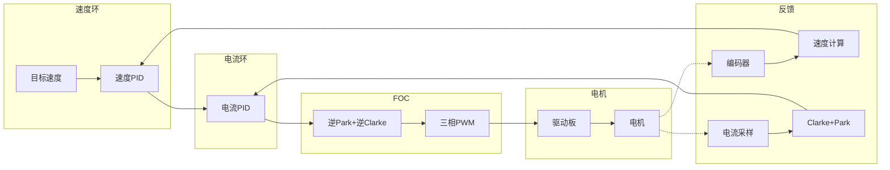
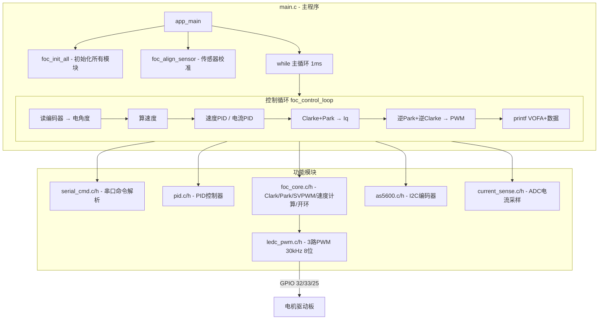
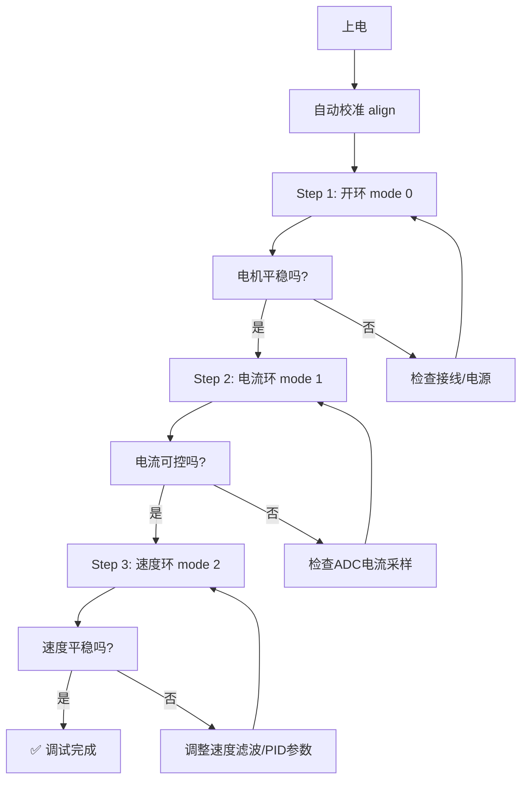
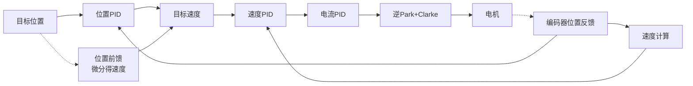

# DengFOC 有感FOC电机控制项目

基于 **ESP-IDF v5.2.7** 实现的 ESP32 有感无刷电机（BLDC）FOC 控制，配合 DengFOC V4 驱动板。

---

## 📋 目录

- [1. 项目概述](#1-项目概述)
- [2. 硬件要求](#2-硬件要求)
- [3. 引脚定义](#3-引脚定义)
- [4. 软件架构](#4-软件架构)
- [5. 模块说明](#5-模块说明)
  - [5.1 LEDC PWM](#51-ledc-pwm)
  - [5.2 AS5600 编码器](#52-as5600-编码器)
  - [5.3 FOC 核心](#53-foc-核心)
  - [5.4 电流采样](#54-电流采样)
  - [5.5 PID 控制器](#55-pid-控制器)
  - [5.6 串口命令](#56-串口命令)
- [6. 控制模式](#6-控制模式)
- [7. 串口命令参考](#7-串口命令参考)
- [8. VOFA+ 调试指南](#8-vofa-调试指南)
- [9. 快速开始](#9-快速开始)
- [10. 调试指南](#10-调试指南)
  - [10.1 三级调试流程](#101-三级调试流程)
  - [10.2 各模式问题排查](#102-各模式问题排查)
  - [10.3 常见问题](#103-常见问题)
  - [10.4 性能测试方法（VOFA+）](#104-性能测试方法vofa)

---

## 1. 项目概述

基于 ESP32 的双闭环（电流环 + 速度环）FOC 控制项目，使用 AS5600 磁编码器获取转子位置，分流电阻采样相电流，实现有感无刷电机的矢量控制。

**控制框图：**



---

## 2. 硬件要求

| 组件 | 型号/规格 |
|------|-----------|
| 主控 | ESP32 (任何版本) |
| 驱动板 | DengFOC V4（或其他 3 路 PWM 输入 BLDC 驱动板） |
| 编码器 | AS5600 磁编码器（I2C 接口） |
| 电机 | 有感/无感 BLDC 电机（建议极对数 7） |
| 电源 | 12.6V / 2A+（给驱动板供电） |
| 电流采样 | 双电阻 0.01Ω + 运放 50 倍增益 |

---

## 3. 引脚定义

| 功能 | GPIO | 说明 |
|------|------|------|
| **PWM A 相** | GPIO 32 | LEDC 通道 0，30kHz |
| **PWM B 相** | GPIO 33 | LEDC 通道 1，30kHz |
| **PWM C 相** | GPIO 25 | LEDC 通道 2，30kHz |
| **电机使能** | GPIO 12 | 拉高使能驱动板 |
| **I2C SDA** | GPIO 19 | AS5600 数据线 |
| **I2C SCL** | GPIO 18 | AS5600 时钟线（400kHz） |
| **ADC A 相电流** | GPIO 39 | ADC1_CHANNEL_3 |
| **ADC B 相电流** | GPIO 36 | ADC1_CHANNEL_0 |

---

## 4. 软件架构



### 文件清单

| 文件 | 功能 |
|------|------|
| `main/main.c` | 主程序，初始化 + 校准 + 主循环 |
| `main/ledc_pwm.c` | PWM 输出（30kHz，8位） |
| `main/as5600.c` | AS5600 编码器 I2C 驱动 |
| `main/foc_core.c` | FOC 核心算法（Clark, Park, SVPWM, 速度计算, 开环控制） |
| `main/current_sense.c` | ADC 电流采样 |
| `main/pid.c` | PID 控制器 |
| `main/serial_cmd.c` | 串口命令系统 |
| `main/CMakeLists.txt` | 组件编译配置 |

---

## 5. 模块说明

### 5.1 LEDC PWM

**文件:** `ledc_pwm.c` / `ledc_pwm.h`

配置 ESP32 LEDC 输出三相互补 PWM，频率 30kHz，8 位精度。

```c
// 初始化 PWM（30kHz，8位）
void ledc_pwm_init(void);

// 设置三相占空比（0.0 ~ 1.0）
void ledc_pwm_set_duty(float dc_a, float dc_b, float dc_c);
```

**配置参数:**

| 参数 | 值 |
|------|-----|
| PWM 频率 | 30 kHz |
| 分辨率 | 8 位（0~255） |
| 定时器模式 | LEDC_LOW_SPEED_MODE |
| 时钟源 | LEDC_AUTO_CLK |

---

### 5.2 AS5600 编码器

**文件:** `as5600.c` / `as5600.h`

通过 I2C 读取 AS5600 磁编码器的 12 位角度数据。

```c
// 初始化 AS5600（I2C: SDA=GPIO19, SCL=GPIO18, 400kHz）
void as5600_init(void);

// 读取角度（弧度，0 ~ 2π）
float as5600_read_angle(void);
```

**通信协议:**

```
AS5600 地址: 0x36
角度寄存器: 0x0C（12位，高4位+低8位）

写入流程:
  START → 地址+W → 0x0C → STOP

读取流程:
  START → 地址+R → 高字节(ACK) → 低字节(NACK) → STOP

角度值 = (data[0] & 0x0F) << 8 | data[1]
```

---

### 5.3 FOC 核心

**文件:** `foc_core.c` / `foc_core.h`

实现 FOC 核心算法：坐标变换、SVPWM、速度计算和开环控制。

```c
// 初始化 FOC 核心
void foc_core_init(float power_supply);

// SVPWM 输出（逆Park + 逆Clarke + 限幅）
void foc_set_voltage(float Uq, float angle_el);

// Clarke + Park 变换（Ia,Ib → Iq）
float foc_calc_iq(float Ia, float Ib, float angle_el);

// 开环速度控制（不需要编码器）
void foc_openloop_velocity(float target_velocity);

// 从编码器计算机械速度（带低通滤波）
float foc_calc_velocity(float angle);
```

#### 坐标变换公式

**Clarke 变换（三相 $$\rightarrow$$ 两相静止坐标系）:**

$$\begin{aligned} I_\alpha &= I_a \\ I_\beta &= \frac{I_a + 2 \cdot I_b}{\sqrt{3}} \end{aligned}$$

**Park 变换（两相静止 $$\rightarrow$$ 两相旋转坐标系）:**

$$I_q = I_\beta \cdot \cos(\theta) - I_\alpha \cdot \sin(\theta)$$

**逆 Park 变换（两相旋转 $$\rightarrow$$ 两相静止坐标系）:**

$$\begin{aligned} U_\alpha &= -U_q \cdot \sin(\theta) \\ U_\beta &= U_q \cdot \cos(\theta) \end{aligned}$$

**逆 Clarke 变换（两相静止 $$\rightarrow$$ 三相）:**

$$\begin{aligned} U_a &= U_\alpha + \frac{V_{bus}}{2} \\ U_b &= \frac{-U_\alpha + \sqrt{3} \cdot U_\beta}{2} + \frac{V_{bus}}{2} \\ U_c &= \frac{-U_\alpha - \sqrt{3} \cdot U_\beta}{2} + \frac{V_{bus}}{2} \end{aligned}$$

#### 低通滤波速度计算

$$\begin{aligned} \Delta\theta &= \theta - \theta_{prev} \\ \Delta\theta &= \begin{cases} \Delta\theta - 2\pi, & \text{if } \Delta\theta > \pi \\ \Delta\theta + 2\pi, & \text{if } \Delta\theta < -\pi \\ \Delta\theta, & \text{otherwise} \end{cases} \\ \omega_{raw} &= \frac{\Delta\theta}{\Delta t} \\ \omega &= 0.9 \cdot \omega_{prev} + 0.1 \cdot \omega_{raw} \end{aligned}$$

---

### 5.4 电流采样

**文件:** `current_sense.c` / `current_sense.h`

ADC 读取相电流，转换为实际电流值（安培）。

```c
void current_sense_init(void);    // 初始化 ADC（12位，11dB衰减），校准零偏移
float current_sense_read_a(void); // 读取 A 相电流 (A)
float current_sense_read_b(void); // 读取 B 相电流 (A)
```

**参数:**

| 参数 | 值 |
|------|-----|
| ADC 精度 | 12 位（0~4095） |
| ADC 衰减 | 11dB（量程 0~3.3V） |
| 参考电压 | 3.3V |
| 分流电阻 | 0.01Ω（10mΩ） |
| 运放增益 | 50 倍 |
| 转换系数 | 2.0 A/V |

**电流计算公式:**

$$\begin{aligned} V_{adc} &= \frac{raw \cdot 3.3V}{4096} \\ I_{phase} &= (V_{adc} - V_{offset}) \cdot \frac{1}{R_{shunt} \cdot G_{amp}} \\ I_{phase} &= (V_{adc} - V_{offset}) \cdot 2.0 \text{ A/V} \end{aligned}$$

其中 $$R_{shunt}=0.01\Omega$$, $$G_{amp}=50$$

---

### 5.5 PID 控制器

**文件:** `pid.c` / `pid.h`

通用 PID 控制器，支持梯形积分、微分项、输出限幅和斜坡限幅。

```c
void pid_init(pid_controller_t *pid, float P, float I, float D,
              float ramp, float limit);
float pid_calculate(pid_controller_t *pid, float error);
```

**计算公式:**

$$\begin{aligned} e(t) &= \text{目标值} - \text{当前值} \\ P_{term} &= K_p \cdot e(t) \\ I_{term} &= I_{prev} + \frac{K_i \cdot \Delta t \cdot (e(t) + e(t-\Delta t))}{2} \\ D_{term} &= \frac{K_d \cdot (e(t) - e(t-\Delta t))}{\Delta t} \\ u(t) &= P_{term} + I_{term} + D_{term} \\ u(t) &= \text{clamp}(u(t), -\text{limit}, +\text{limit}) \\ \frac{du}{dt} &= \text{clamp}\left(\frac{u(t) - u(t-\Delta t)}{\Delta t}, -\text{ramp}, +\text{ramp}\right) \end{aligned}$$

**电流环 PID 参数（推荐）:**

| 参数 | 值 |
|------|-----|
| P | 1.5 |
| I | 50.0 |
| D | 0.0 |
| ramp | 100000.0 |
| limit | Vbus/2（6.3V） |

**速度环 PID 参数（推荐）:**

| 参数 | 值 |
|------|-----|
| P | 0.15 |
| I | 3.0 |
| D | 0.0 |
| ramp | 500.0 |
| limit | 1.0（A） |

**PID 抗积分饱和说明：**

当 PID 输出达到限幅值时，积分项会被自动回退，避免积分饱和导致超调和振荡：

```c
if (output != output_limited) {
    // 输出饱和时，积分项回退到刚好不饱和的值
    integral = output_limited - (proportional + derivative);
}
```

---

### 5.6 串口命令

**文件:** `serial_cmd.c` / `serial_cmd.h`

通过 UART 接收并解析用户命令，支持速度设置、模式切换等。

```c
void serial_cmd_init(void);
uint8_t serial_cmd_process(serial_cmd_result_t *result);
```

---

## 6. 控制模式

| 模式 | 命令 | 说明 |
|------|------|------|
| **开环** (`mode 0`) | `mode 0` | 无需编码器和电流采样，直接合成角度，固定 Uq=Vbus/3≈4.2V。
                        目标速度为 0 时自动停止输出。 |
| **电流闭环** (`mode 1`) | `mode 1` | 单电流环：目标电流 → PID → Uq。
                        适合力矩/力控制，响应快，无抖动。 |
| **速度闭环** (`mode 2`) | `mode 2` | **默认** 双闭环：速度PID → 目标电流 → 电流PID → Uq。
                        编码器测速带低通滤波(α=0.95)，抑制量化噪声。 |

---

## 7. 串口命令参考

打开串口监视器（115200 baud），输入命令后回车。

| 命令 | 格式 | 示例 | 说明 |
|------|------|------|------|
| `help` | `help` | `help` | 显示帮助信息 |
| `v` | `v <速度>` | `v 5` | 设置目标速度 (rad/s) |
| `c` | `c <电流>` | `c 0.5` | 设置目标电流 (A) |
| `s` | `s` | `s` | 立即停止电机 |
| `mode` | `mode <n>` | `mode 2` | 切换控制模式 |
| `pid` | `pid` | `pid` | 查看电流环 PID 参数 |
| `pid <p/i/d/ramp/limit> <val>` | `pid p 2.0` | 设置电流环参数 |
| `vpid` | `vpid` | `vpid` | 查看速度环 PID 参数 |
| `vpid <p/i/d/ramp/limit> <val>` | `vpid i 5.0` | 设置速度环参数 |

**示例流程:**
```
>>> v 5          ← 设置速度 5 rad/s
>>> mode 2       ← 切换到速度闭环
>>> s            ← 停止
>>> mode 0       ← 切换到开环
>>> v 10         ← 开环速度 10 rad/s

>>> pid          ← 查看电流环参数
  电流环 PID: P=1.500  I=50.000  D=0.000  ramp=100000  limit=6.300
>>> pid p 2.0    ← 把电流环 P 改成 2.0（实时生效）
  电流环 PID: P=2.000  I=50.000  D=0.000  ramp=100000  limit=6.300

>>> vpid i 5.0   ← 把速度环 I 改成 5.0
  速度环 PID: P=0.150  I=5.000  D=0.000  ramp=500  limit=1.000
```

---

## 8. VOFA+ 调试指南

**配置步骤:**

1. 打开 VOFA+
2. 右上角协议选择: **FireWater**
3. 左侧选择串口: 对应 ESP32 的 COM 口
4. 波特率: **115200**
5. 点击 🟢 **开始** 连接
6. 下方点击 **通道1~通道7** 勾选显示
7. 将通道拖入绘图窗口

**数据通道说明:**

| 通道 | 数据 | 单位 | 说明 |
|------|------|------|------|
| 通道1 | 机械速度 | rad/s | 编码器计算的实际速度 |
| 通道2 | 目标速度 | rad/s | 用户设定的目标速度 |
| 通道3 | Iq 电流 | A | Clarke+Park 后的 q 轴电流 |
| 通道4 | Uq 电压 | V | PID 输出的 q 轴电压 |
| 通道5 | 电角度 | rad | 当前电角度（0~2π） |
| 通道6 | A 相电流 | A | ADC 原始 A 相电流 |
| 通道7 | B 相电流 | A | ADC 原始 B 相电流 |
| 通道8 | 电流环目标 | A | **电流环的输入目标值**：mode 1 下等于用户设的 `c` 值；mode 2 下等于速度 PID 的输出（即速度环请求的电流） |

---

## 9. 快速开始

### 编译烧录

```bash
idf.py set-target esp32
idf.py build
idf.py -p COM16 -b 460800 flash
idf.py -p COM16 monitor
```

### 接线

```
ESP32           DengFOC 驱动板
─────           ─────────────
GPIO 32 ─────── A相 (PWM)
GPIO 33 ─────── B相 (PWM)
GPIO 25 ─────── C相 (PWM)
GPIO 12 ─────── 使能
GND    ─────── GND

ESP32           AS5600
─────           ──────
GPIO 19 ─────── SDA
GPIO 18 ─────── SCL
3.3V   ─────── VCC
GND    ─────── GND

驱动板 ←── 12.6V 电源
驱动板 ←── U/V/W → 电机
```

### 运行测试

**标准调试流程：**

```bash
# 1. 烧录并打开串口
idf.py -p COM16 -b 460800 flash monitor

# 2. 看到帮助信息后，先开环测试
mode 0           # 切换到开环模式
v 5              # 设置开环速度 5 rad/s

# 3. 观察电机平稳旋转后，切换到闭环
s                # 先停止
mode 2           # 切换到速度闭环
v 3              # 从小速度开始试
v 5
v 10             # 逐步加速

# 4. 切换到电流闭环测试
s                # 停止
mode 1           # 切换到电流闭环
c 0.2            # 目标电流 0.2A
c 0.5

# 5. 停止
s
```

---

## 10. 调试指南

### 10.1 三级调试流程



### 10.2 各模式问题排查

| 现象 | 可能原因 | 解决方案 |
|------|----------|----------|
| 开环电机不转 | 驱动板未使能/电源未接 | 检查 GPIO12 电平，检查 12.6V 电源 |
| 开环电机抖动 | 三相线序错误 | 任意交换两相线序 |
| 电流环不可控 | ADC 采样异常 | 串口观察 Ia/Ib，检查运放输出是否在 0~3.3V |
| 速度环抖动 | 速度测量噪声大/PID过强 | 加大速度滤波 α(0.95→0.98)，降低 VEL_P/VEL_I |
| 速度环低频振荡 | 积分过强 | 降低 VEL_I 或启用斜坡限幅 |
| 高速上不去 | 电压饱和 | 提高 VBUS，或检查 `foc_set_voltage` 限幅 |

### 10.3 常见问题

#### Q: 电机不转？<a name="q-motor-not-running"></a>

排查顺序：
1. 驱动板 12.6V 电源指示灯亮了吗？
2. GPIO 12 使能拉高了吗？
3. ESP32 GND 和驱动板 GND 共地了吗？
4. 先用 `mode 0`（开环）测试，开环不需要编码器和电流采样

#### Q: AS5600 读取失败？

检查 I2C 接线：SDA→GPIO19，SCL→GPIO18，确认模块有上拉电阻。

#### Q: 电流采样不准？

初始化时自动校准零偏移（1000次平均），检查 ADC 引脚无其他电路干扰。

#### Q: 电机振动大？

减小 PID 的 P 或 I 参数，检查三相线序是否正确。

#### Q: 切换到闭环后电机飞转？

可能原因：① PID 积分饱和（已添加 anti-windup 解决）
② 模式切换时 PID 未重置（已修复，切换时自动重置 PID）
③ PID 参数过于激进（当前参数经过实际调试验证）

#### Q: 速度闭环抖动很厉害？

- 先确认电流环（mode 1）是否平稳
- 如果电流环正常，问题在速度测量噪声
- 加大速度低通滤波系数（`foc_core.c` 中 α=0.95→0.98）
- 降低速度环 P 值（当前 VEL_P=0.15）
- 降低速度环限幅（当前 VEL_LIMIT=1.0A）

---

### 10.4 性能测试方法（VOFA+）

以下测试全程使用 **VOFA+ FireWater 协议** 观察波形，无需额外仪器。

#### 测试 1：电流环稳态精度

**目的：** 验证电流环在不同目标值下的跟踪误差。

| 步骤 | 操作 | 记录 |
|------|------|------|
| 1 | `mode 1` 切换到电流环 | |
| 2 | `c 0.05` → 等待 3 秒 | 通道3(Iq)=?  通道8(目标)=0.05 |
| 3 | `c 0.10` → 等待 3 秒 | 通道3(Iq)=?  通道8(目标)=0.10 |
| 4 | `c 0.15` → 等待 3 秒 | ... |
| 5 | `c 0.20` → 等待 3 秒 | ... |
| 6 | `c 0.30` → 等待 3 秒 | ... |
| 7 | `c 0.40` → 等待 3 秒 | ... |
| 8 | `c 0.50` → 等待 3 秒 | ... |

**观察指标：** 通道3 是否等于 通道8？偏差多大？Uq（通道4）是否饱和？

---

#### 测试 2：速度-电压曲线

**目的：** 画出 Uq 与速度的关系，确定饱和点。

| 步骤 | 操作 | 记录 |
|------|------|------|
| 1 | `mode 2` 切换到速度环 | |
| 2 | `v 10` → 等待 5 秒 | 通道1(速度)=?  通道4(Uq)=?  通道3(Iq)=? |
| 3 | `v 20` → 等待 5 秒 | ... |
| 4 | `v 30` → 等待 5 秒 | ... |
| 5 | `v 40` → 等待 5 秒 | ... |
| 6 | `v 50` → 等待 5 秒 | ... |
| 7 | `v 60` → 等待 5 秒 | ... |
| 8 | `v 70` → 等待 5 秒 | ... |
| 9 | `v 75` → 等待 5 秒 | ... |

**观察指标：** 速度与 Uq 是否线性？在哪个点 Uq 接近 6.3V 饱和？

---

#### 测试 3：速度环阶跃响应

**目的：** 观察速度从 0 加速到目标的动态过程（超调、调节时间）。

| 步骤 | 操作 | 观察重点 |
|------|------|----------|
| 1 | `s` 确保电机停止 | |
| 2 | `v 50` + `mode 2` | 通道1(速度)爬升曲线：是否超调？是否振荡？ |
| 3 | 等稳定后 → `s` | |
| 4 | `v 75` + `mode 2` | 通道8(电流目标)是否顶到 1.0A 限幅？ |

**观察指标：** 超调量（%）、调节时间（到稳定需几秒）、是否有振荡。

---

#### 测试 4：抗扰动测试

**目的：** 验证速度环抵抗外力干扰的能力。

| 步骤 | 操作 | 观察重点 |
|------|------|----------|
| 1 | `mode 2` + `v 50` | 等速度稳定 |
| 2 | **用手捏一下电机轴** 再松开 | 通道1掉下去多少？多久恢复？通道8瞬间跳了多少？ |

**观察指标：** 速度跌落（rad/s）、恢复时间（s）、电流冲击（A）。

---

## 11. 性能测试数据

以下为实际调试中测得的性能数据（测试环境：7极对 BLDC 电机，12.6V 供电，AS5600 编码器，1kHz 控制频率）。

### 11.1 速度控制性能

| 项目 | 数值 | 说明 |
|------|------|------|
| 最高转速（速度闭环） | **75 rad/s** ≈ 716 RPM | 受电压限幅限制（Uq=6.2V，接近 6.3V 极限） |
| 最高转速（开环） | 取决于目标速度设置 | 开环无反馈，目标速度可高于 75 rad/s |
| 速度控制分辨率 | ~1.5 rad/s | AS5600 12位编码器量化噪声 |
| 速度测量低通滤波 | α=0.95（截止 ~8Hz） | 经调试确定，兼顾响应速度和平滑度 |

### 11.2 电流控制性能

| 项目 | 数值 | 说明 |
|------|------|------|
| 电流环响应 | 稳定，无抖动 | P=1.5, I=50 组合经验证工作良好 |
| 最大输出电压 | **6.3V**（Uq 限幅） | VBUS/2，受 `foc_set_voltage` 限幅 |
| 电流环输出饱和 | Uq=6.2V @ 75 rad/s | 高速时电压饱和，速度受限于电压 |
| 最小启动电流 | **0.045 A** | 电机刚能转动的电流值 |
| 最大有效电流 | **0.35 A** | 再增大电流 Uq 饱和，速度不再增加 |

**电流环实测数据（12.6V 供电）：**

| 目标电流 | 实测 Iq | Uq | 电机状态 |
|---------|---------|----|---------|
| 0.045 A | ~0.045 A | ~0.8 V | 刚能转动 |
| 0.10 A | ~0.10 A | ~1.8 V | 低速旋转 |
| 0.20 A | ~0.20 A | ~3.5 V | 中速旋转 |
| 0.35 A | ~0.35 A | ~5.5 V | 达到最高速度 |
| 0.50 A | ~0.50 A | ~6.2 V | 电压饱和，速度不再增加 |

### 11.3 电压-速度关系

```
Uq (V)         速度 (rad/s)
─────          ───────────
1.0            约 12
2.0            约 24
3.0            约 36
4.0            约 48
5.0            约 60
6.2            约 75 (饱和)
```

> 注：速度与 Uq 近似线性关系，斜率取决于电机 KV 值和负载。

### 11.4 控制参数总结

| 参数 | 电流环 | 速度环 |
|------|--------|--------|
| P | 1.5 | 0.15 |
| I | 50.0 | 3.0 |
| D | 0.0 | 0.0 |
| Ramp | 100000 | 500 |
| Limit | 6.3V | 1.0A |
| 抗饱和 | ✅ 已启用 | ✅ 已启用 |
| 模式切换重置 | ✅ 自动重置 | ✅ 自动重置 |

## 12. 后续规划

以下为项目后续发展方向，每个方向包含原理说明和大致实现思路。

### 11.1 无感 FOC 控制

**目标：** 去掉 AS5600 编码器，通过反电动势（BEMF）观测器估算转子位置和速度，实现无传感器 FOC。

**原理：**

电机反电动势与转子位置的关系：

$$\begin{aligned} E_a &= K_e \cdot \omega \cdot \sin(\theta) \\ E_b &= K_e \cdot \omega \cdot \sin\left(\theta - \frac{2\pi}{3}\right) \\ E_c &= K_e \cdot \omega \cdot \sin\left(\theta + \frac{2\pi}{3}\right) \end{aligned}$$

其中 $$K_e$$ = 反电动势常数，$$\omega$$ = 电角速度，$$\theta$$ = 电角度。

通过检测电机端电压和相电流，用观测器估算反电动势，进而推算出转子位置。

**实现思路：**

1. **滑模观测器（Sliding Mode Observer, SMO）** — 最常用的方法

   ```c
   // 观测器状态
   typedef struct {
       float I_alpha_est;      // 估计的 α 轴电流
       float I_beta_est;       // 估计的 β 轴电流
       float E_alpha;          // 估计的 α 轴反电动势
       float E_beta;           // 估计的 β 轴反电动势
       float z_alpha;          // SMO 滑模控制函数输出
       float z_beta;
       float theta;            // 估算的电角度
       float omega;            // 估算的电角速度
   } smo_observer_t;
   
   // 每步更新流程:
   // 1. 读电流 Ia, Ib → Iα, Iβ
   // 2. 滑模观测器: I_est' = A·I_est + B·V + K·sign(I - I_est)
   // 3. 低通滤波反电动势: E_alpha_lpf, E_beta_lpf
   // 4. 角度补偿: theta = atan2(-E_alpha, E_beta) + angle_compensate
   // 5. 速度: omega = (theta - theta_prev) / dt
   ```

2. **启动策略（重要！）** — 零速时反电动势为 0，无法观测，需要特殊处理

   ```mermaid
   graph LR
       A[0~50 RPM<br/>开环强拖 IF控制] -->|角度逐步过渡| B[50~200 RPM<br/>切换过渡区]
       B -->|完全切换| C[>200 RPM<br/>闭环运行]
       
       style A fill:#f9f,stroke:#333
       style B fill:#ff9,stroke:#333
       style C fill:#9f9,stroke:#333
   ```

   $$\theta = (1 - k) \cdot \theta_{开环} + k \cdot \theta_{观测器}, \quad k = \frac{\omega - 50}{200 - 50}$$

3. **所需新增文件**

   | 文件 | 说明 |
   |------|------|
   | `smo_observer.c/h` | 滑模观测器实现 |
   | `bemf_pll.c/h` | 反电动势锁相环（平滑角度和速度） |
   | `startup.c/h` | 开环强拖启动逻辑 |

4. **性能对比**

   | 方面 | 有感 FOC | 无感 FOC |
   |------|----------|----------|
   | 低速性能 | ✅ 优秀（零速也可控） | ❌ 差（需开环强拖） |
   | 高速性能 | ✅ 好 | ✅ 好 |
   | 成本 | ❌ 需编码器 | ✅ 无需额外硬件 |
   | 启动冲击 | ✅ 无 | ❌ 可能抖动 |
   | 负载突变 | ✅ 好 | ❌ 可能失步 |

---

### 11.2 PID 参数自整定

**目标：** 自动确定电流环和速度环的 PID 参数，替代手动调参。

**方法一：Ziegler-Nichols 继电反馈法**

步骤：
1. 仅用 P 控制（I=0, D=0），从较小值开始
2. 在设定值上加一个小幅方波扰动（继电器特性）
3. 观察系统输出是否产生等幅振荡
4. 记录振荡周期 $$T_u$$ 和临界增益 $$K_u$$
5. 按 Z-N 公式计算 PID 参数：

$$\begin{aligned} K_p &= 0.6 \cdot K_u \\ K_i &= \frac{1.2 \cdot K_u}{T_u} \\ K_d &= 0.075 \cdot K_u \cdot T_u \end{aligned}$$

**方法二：模型辨识法（更精确，计算量大）**

步骤：
1. 给系统一个阶跃输入（如 1V 阶跃电压）
2. 记录电流响应曲线（Iq 随时间变化）
3. 将响应拟合为一阶惯性+延时模型：

$$G(s) = \frac{K \cdot e^{-\tau_d \cdot s}}{T \cdot s + 1}$$

其中 $$K$$ = 稳态增益，$$\tau_d$$ = 纯延时，$$T$$ = 时间常数

4. 按 Cohen-Coon 或 IMC 公式计算 PID

**实现思路：**

```c
// 自整定状态机
typedef enum {
    AUTOTUNE_IDLE,          // 空闲
    AUTOTUNE_EXCITING,      // 施加激励信号
    AUTOTUNE_MEASURING,     // 测量响应
    AUTOTUNE_CALCULATING,   // 计算参数
    AUTOTUNE_DONE           // 完成
} autotune_state_t;

typedef struct {
    autotune_state_t state;
    float Ku;               // 临界增益
    float Tu;               // 临界周期
    float P, I, D;          // 计算出的 PID 参数
    float output_step;      // 激励幅值
    uint32_t samples[1024]; // 响应采样缓冲区
    uint32_t sample_count;
} autotune_t;
```

**所需新增文件：**

| 文件 | 说明 |
|------|------|
| `autotune.c/h` | PID 自整定逻辑 |
| `sysid.c/h` | 系统辨识辅助函数 |

---

### 11.3 速度环加速度前馈

**目标：** 在速度变化时，提前补偿惯性力矩，减小速度超调和跟随误差。

**原理：**

传统速度环只有反馈控制（误差→PID），速度变化时需要等误差出现后才调整，响应慢。

加速度前馈在**目标速度变化时直接计算需要的加速电流**，先发出去，PID 只负责修正剩余误差。

$$I_{q\_target} = \underbrace{PID(\omega_{target} - \omega_{actual})}_{\text{反馈部分}} + \underbrace{\frac{J}{K_t} \cdot \frac{d\omega_{target}}{dt}}_{\text{前馈部分}}$$

其中：
- $$J$$ = 电机+负载的转动惯量 $$(kg \cdot m^2)$$
- $$K_t$$ = 电机力矩常数 $$(Nm/A)$$
- $$\frac{d\omega}{dt}$$ = 目标角加速度 $$(rad/s^2)$$

**实现思路：**

```c
// 加速度前馈计算
float ff_accel = 0;
static float last_target_vel = 0;

// 在每次目标速度变化时计算前馈
float target_accel = (target_velocity - last_target_vel) / dt;
if (fabsf(target_accel) > 0.1f) {   // 有显著加速度变化时
    // J/Kt 可通过实验测定，或从电机参数表查找
    ff_accel = g_inertia_over_kt * target_accel;
}
last_target_vel = target_velocity;

// 速度PID输出 + 前馈 → 最终目标电流
float current_target = pid_calculate(&g_pid_velocity, error) + ff_accel;
```

**参数测定方法：**

1. 手动设定 `J/Kt`（从电机规格书查）
2. 或用系统辨识方法自动测定

**效果对比（使用 VOFA+ 观察）：**

| 场景 | 无前馈 | 有前馈 |
|------|--------|--------|
| 阶跃响应 | 有超调 | 超调减小 50%+ |
| 梯形加减速 | 有跟随延迟 | 几乎无延迟 |
| 正弦波跟踪 | 相位滞后 | 相位滞后减小 |

---

### 11.4 位置环及速度前馈

**目标：** 实现位置闭环控制（如转到指定角度），并加入速度前馈提高跟踪性能。

**控制框图：**



**位置环实现：**

```c
typedef struct {
    float target_position;      // 目标位置 (rad, 机械角)
    float position_error;       // 位置误差
    pid_controller_t pid;       // 位置 PID
} position_controller_t;

// 位置环计算 (运行在 1kHz 控制循环中)
float pos_ctrl(position_controller_t *ctrl, float target_pos, float current_pos) {
    float error = target_pos - current_pos;
    error = fmodf(error, 2 * PI);  // 归一化到 -π ~ π
    if (error > PI)  error -= 2 * PI;
    if (error < -PI) error += 2 * PI;
    
    float velocity_target = pid_calculate(&ctrl->pid, error);
    return velocity_target;  // 作为速度环的输入
}
```

**位置前馈（速度前馈）：**

从目标位置直接微分得到目标速度，使速度环提前响应：

$$\omega_{ff} = \frac{\theta_{target} - \theta_{target\_prev}}{\Delta t} \\ \omega_{target} = PID_{输出} + \omega_{ff}$$

**实现思路：**

```c
// 在 control_loop 中增加一层
switch (g_ctrl_mode) {
    case CTRL_MODE_POSITION:  // 新增位置环模式
        float vel_from_pos = pos_control(target_pos, current_pos);
        float ff_vel = (target_pos - last_target_pos) / dt;
        target_velocity = vel_from_pos + ff_vel;
        // 然后进入速度环 + 电流环...
        break;
}
```

**新增命令：**

| 命令 | 格式 | 示例 | 说明 |
|------|------|------|------|
| `pos` | `pos <弧度>` | `pos 3.14` | 转到 180° 位置 |
| `pos_home` | `pos_home` | `pos_home` | 回到 0° 位置 |

---

### 11.5 开发板性能测试

**目标：** 量化 ESP32 在 FOC 控制场景下的实时性能指标。

#### 测试项目

| 编号 | 测试项 | 测量方法 | 关键指标 |
|------|--------|----------|----------|
| T1 | **控制循环执行时间** | GPIO 翻转 + 逻辑分析仪 | 最大/最小/平均循环时间 |
| T2 | **中断响应延迟** | 外部中断 + GPIO 翻转 | 中断到输出变化的时间 |
| T3 | **PWM 频率稳定性** | 频率计测量 PWM 引脚 | 频率抖动 (±Hz) |
| T4 | **ADC 采样率** | 定时读取 + 统计 | 每秒采样次数 |
| T5 | **I2C 通信延迟** | AS5600 读取耗时统计 | 单次读取时间 |
| T6 | **内存/CPU 占用** | `heap_caps_get_free_size()` 等 | 剩余栈/堆空间 |
| T7 | **看门狗压力测试** | 故意延长某次循环 | 最慢循环时间，触发 WDT 临界值 |

#### 测试工具

逻辑分析仪（推荐 Saleae）、VOFA+ 数据记录、ESP-IDF 性能计数 API。

#### 测试用例 1：循环时间抖动

```c
// 在控制循环头尾翻转 GPIO 26
static int64_t t_min = INT64_MAX, t_max = 0, t_sum = 0;
static uint32_t t_count = 0;

void test_loop_jitter(void) {
    int64_t t_start = esp_timer_get_time();
    
    // ---- 正常控制循环 ----
    gpio_set_level(26, 1);
    foc_control_loop();
    gpio_set_level(26, 0);
    // ---- 循环结束 ----
    
    int64_t t_end = esp_timer_get_time();
    int64_t t_elapsed = t_end - t_start;
    
    if (t_elapsed < t_min) t_min = t_elapsed;
    if (t_elapsed > t_max) t_max = t_elapsed;
    t_sum += t_elapsed;
    t_count++;
    
    if (t_count >= 10000) {
        // 每10000次打印一次统计
        ESP_LOGI(TAG, "循环时间: min=%lldus max=%lldus avg=%.1fus",
                 t_min, t_max, (float)t_sum / t_count);
        t_min = INT64_MAX; t_max = 0; t_sum = 0; t_count = 0;
    }
}
```

**预期结果（ESP32 @ 160MHz）：**

| 测试项 | 典型值 | 说明 |
|--------|--------|------|
| 控制循环时间 | 150~400 μs | 取决于启用功能多少 |
| ADC 采样延迟 | ~20 μs | adc1_get_raw 调用时间 |
| I2C 读取延迟 | ~200 μs | 400kHz 下读取 2 字节 |
| 空余堆空间 | ~180 KB | 剩余可用 DRAM |

**优化方向：**

| 问题 | 优化方法 |
|------|----------|
| 循环时间过长 | 降低控制频率（500Hz），提高 tick rate |
| 浮点运算慢 | 替换为定点数运算（Q15 格式） |
| I2C 读取慢 | 改用 SPI 编码器，或硬件 I2C 中断 |
| PID 计算慢 | 预计算 sin/cos 查找表，查表替代计算 |
| 打印开销大 | 降低打印频率，用 DMA 传输 |

---

## 参考

- [DengFOC 开源库](https://github.com/ToanTech/DengFOC)
- [SimpleFOC](https://docs.simplefoc.com/)
- [ESP-IDF LEDC 文档](https://docs.espressif.com/projects/esp-idf/en/latest/esp32/api-reference/peripherals/ledc.html)
- [AS5600 数据手册](https://ams.com/as5600)
- [Ziegler-Nichols Tuning Method](https://en.wikipedia.org/wiki/Ziegler%E2%80%93Nichols_method)
- [Sliding Mode Observer for PMSM](https://ieeexplore.ieee.org/document/6603940)
